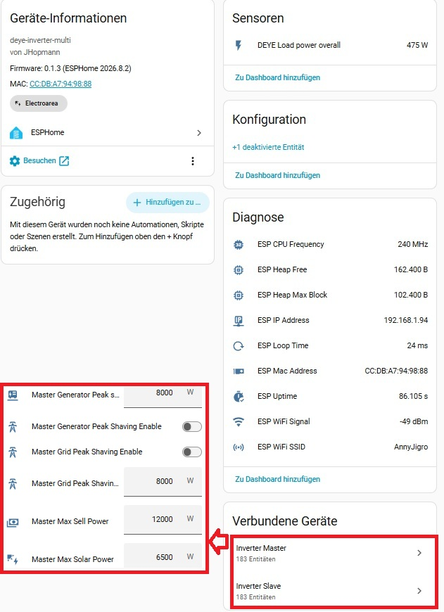
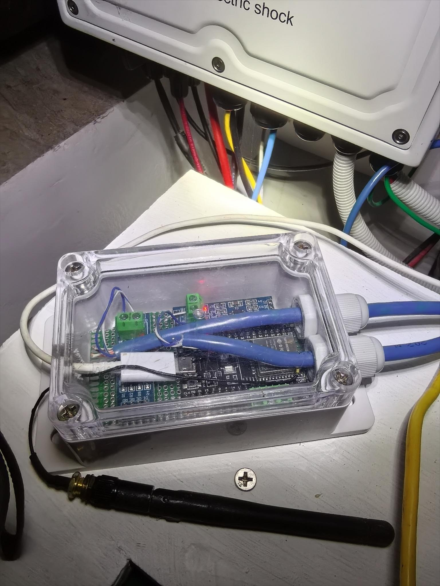
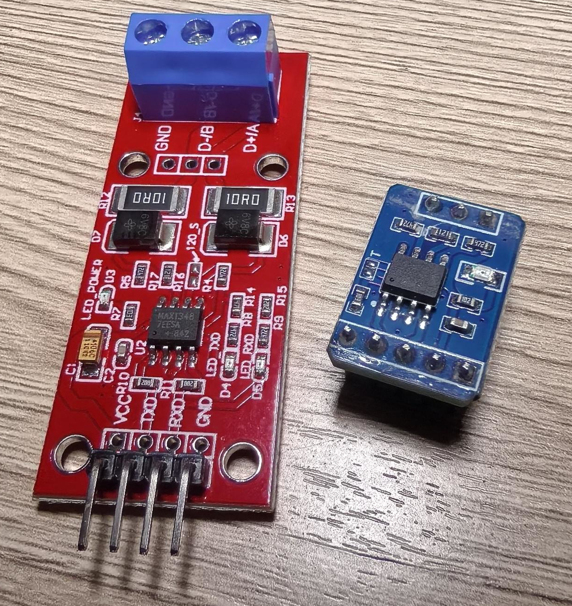
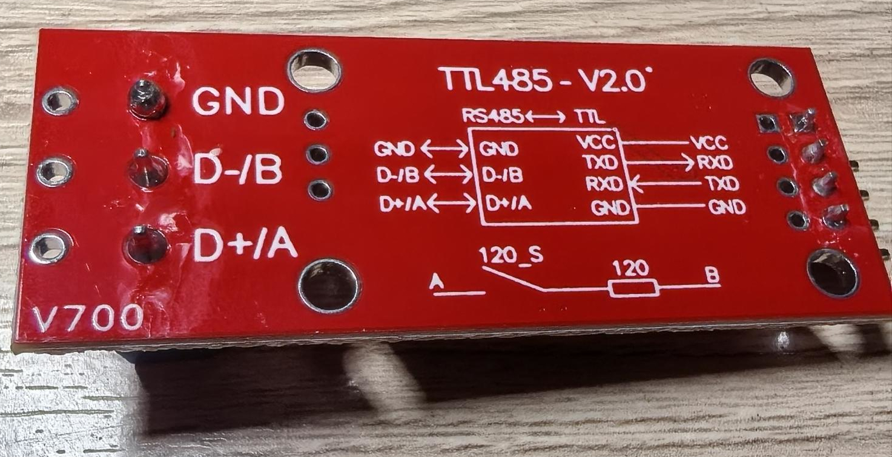
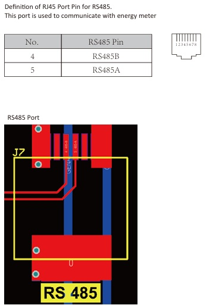

# ESPHome Deye Multiple Inverter

<!--
Copyright 2025 Lewa-Reka <lewareka.yt@gmail.com>

Licensed under the Apache License, Version 2.0 (the "License");
you may not use this file except in compliance with the License.
You may obtain a copy of the License at

    http://www.apache.org/licenses/LICENSE-2.0

Unless required by applicable law or agreed to in writing, software
distributed under the License is distributed on an "AS IS" BASIS,
WITHOUT WARRANTIES OR CONDITIONS OF ANY KIND, either express or implied.
See the License for the specific language governing permissions and
limitations under the License.
-->


An ESPHome-based solution for monitoring and controlling Deye photovoltaic inverters via Modbus RTU communication. This project provides comprehensive integration with Home Assistant, enabling real-time monitoring and control of solar power systems.

For an excellent overview of the features and installation watch the video from the author of the original project (Lewa-Reka)
Installation & Presentation: https://youtu.be/iJjsA_MzmnE 

In this project you will find all ESP-related sensors at the top-level, 
the devices itself are shown seperate in Home Assistant:



The entities have a prefix of your choice. Default is "Master ..."/"Slave ...."

## Hardware

Depending on your preferences and the availability you can install the project on your ESP-Board of your choice.

*** Recommendation: Use a dual core ESP32 as the connection to multiple modbus and sending the data via WIFI can create load on your chip.

You can find an overview at 
 https://docs.espressif.com/projects/esp-idf/en/v4.4/esp32/hw-reference/chip-series-comparison.html

I used for my test an ESP32-WROOM-32U which is a "Xtensa® dual-core 32-bit LX6" w. external antenna.



The modbus-connectivity is done with a chip called MAX485, a cheap and small chip dedicated for RS485-protocol.
There are other products on the market (SN75176B from Texas Instruments or SP3485 from MaxLinear)
There are different versions of the MAX485 on the market, a 5 volt and a 3.3 volt version. 
Important to consider that your ESP32 runs on 3.3 volt and cannot handle signals from the 5 volt MAX485. 
If you ONLY send data from the ESP to the chip, fine, in the 5 volt version you have to implement a voltage-divider when the chip is sending to the ESP.

I would recommend one of these MAX3485 (the 3 stands for 3.3 volt-version).

The left one is a board with automatic flow control. You do not need to specify the flow control-pin in the config, and you do not need to connect it to any ESP32-GPIO.
From my experience, the pricing is (nearly) the same. (Aliexpress 55 baht = 1.5$)



As you can see here, you only need to connect A, B and Ground (GND) and you are done.
Power supply 3.3 volt is provided by the ESP32-board.



For the connectivity I used the meter-port on my DEYE Inverter. 
The cable can be any normal Cat5e. Mine is cut into half and the color of the wires was determined from the TRANSPARENT plug. 

$${\color{red}!!! Be\ careful\  not\ to\ use\ the\ wrong\ wires\ as\ it\ can\ damage\ your\ RS485-chip\ OR\ EVEN\ WORSE\ your\ inverter\ !!!}$$

The DEYE documentation states that the pins 4&5 are used on the meter-port different compared to the RS485-Port. 
I have seen statements the meter-port does not deliver data. Well, mine is! But please check your documentation and test. (Feedback welcome!)



## 📚 Documentation

- **[Supported Devices](docs/SUPPORTED_DEVICES.md)**: List of supported inverters and specific configurations.
- **[Register-Documentation](docs/Deye.Modbus.protocol.V118.pdf)**: Original DEYE modbus documentation.
- **[Features & Capabilities](docs/FEATURES.md)**: Detailed overview of features, safety mechanisms, and monitoring capabilities.
- **[Installation Guide](docs/INSTALLATION.md)**: Hardware requirements, wiring diagrams, and step-by-step installation instructions.
- **[Configuration](docs/CONFIGURATION.md)**: Configuration options, parameters, and update instructions.
- **[Troubleshooting](docs/TROUBLESHOOTING.md)**: Common issues and solutions.
- **[Contributing](docs/CONTRIBUTING.md)**: Guidelines for contributing to the project.

## 📄 License

This project is licensed under the Apache License 2.0 - see the [LICENSE](LICENSE) file for details.

### Copyright Notice

```
Copyright 2025 Lewa-Reka <lewareka.yt@gmail.com>

Modifications Copyright 2026 JHopmann <Joerg@Hopmann.name>

Licensed under the Apache License, Version 2.0 (the "License");
you may not use this file except in compliance with the License.
You may obtain a copy of the License at

    http://www.apache.org/licenses/LICENSE-2.0

Unless required by applicable law or agreed to in writing, software
distributed under the License is distributed on an "AS IS" BASIS,
WITHOUT WARRANTIES OR CONDITIONS OF ANY KIND, either express or implied.
See the License for the specific language governing permissions and
limitations under the License.
```
### BASIS (Fork/History)

This project is based on a fork from the original deye inverter project created by Lewa-Reka (https://github.com/Lewa-Reka/esphome-deye-inverter).
Forked on August 21, 2026

This project is intended to extend the work of Lewa-Reka to connect multiple inverters to one single ESP32-instance.

### Third-Party Components

This project uses ESPHome and related components. Please refer to the [NOTICE](NOTICE) file for additional license information.

## 🙏 Acknowledgments

- [Deepseek Chatbot](https://chat.deepseek.com/) Nicknamed "Deepy" for his patience with me regarding my sometimes rambling questions.
- [ESPHome Team](https://esphome.io/) for the excellent home automation platform
- [Home Assistant Community](https://community.home-assistant.io/) for continuous support and inspiration

## 📞 Support

- **GitHub Issues**: [Report bugs or request features](https://github.com/JHopmann/esphome-deye-multi/issues)
- **Home Assistant Community**: [ESPHome section](https://community.home-assistant.io/c/esphome/) for general ESPHome help

## 🔗 Related Projects

- [ESPHome Official Docs](https://esphome.io/) - ESPHome documentation

---

**⚠️ Disclaimer**: This project is not officially affiliated with Deye. Use at your own risk and ensure compliance with local electrical codes and regulations. Always consult with a qualified electrician for installation and safety verification. The authors are not responsible for any damage to equipment or injury resulting from the use of this software.
